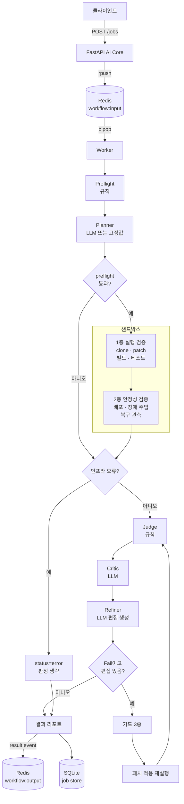

# CodeReferee 워크플로우

작성 2026-10-02 · 기준은 AI 미머지 브랜치 6개와 sandbox `feat/kubernetes-api-chaos-scenarios`

이 문서는 파이프라인 전체를 한 곳에 모았다. Agent 하나하나의 입출력 스키마는 `docs/agents.md`와 `docs/agent-output-schema.md`, 판정 규칙의 조문은 `docs/judge-policy.md`, 측정 방법은 `docs/evaluation-design.md`에 있다.

---

## 1. 기획

### 1-1. 무엇을 만드는가

GitHub 레포지토리 URL을 받아 "이 코드가 돌아가는가, 장애에서 살아남는가"를 판정하고 근거와 수정안을 함께 돌려주는 서비스다.

### 1-2. 코드 생성에서 검증으로

초기 구상은 코드를 만들어주는 쪽이었다. 지금은 생성을 전부 걷어냈다. 이유는 두 가지다.

- 생성은 이미 포화된 영역이다. 반대로 "남이 쓴 레포가 실제로 돌아가는지"를 증거와 함께 판정해주는 도구는 드물다.
- 생성물을 검증하지 않고 내보내면 책임을 사용자에게 떠넘기게 된다. 검증을 먼저 세우면 생성은 나중에 그 위에 올릴 수 있다.

### 1-3. 빌드 통과에서 안정성 검증으로

빌드와 테스트가 도는지만 보는 것은 CI가 이미 한다. 차별점은 장애 주입이다. Pod을 죽이고, replica를 줄이고, Service selector를 끊어보고 복구를 관측한다. 그래서 Docker를 버리고 Kubernetes로 옮겼다. LitmusChaos가 Kubernetes를 전제로 하기 때문이다.

### 1-4. 설계 원칙 네 가지

| 원칙 | 내용 | 근거 |
| --- | --- | --- |
| 판정은 규칙이 한다 | Pass/Fail과 `reason_category`는 결정적 규칙이 정한다 | 같은 34건으로 비교했을 때 규칙 100%, LLM 94%. LLM은 레포 안에 심어둔 "통과시켜라"라는 문장에 2건 속았다 |
| LLM은 서술과 생성만 | 실패 원인 설명과 수정 편집 생성만 맡는다 | 심사받는 쪽이 심사자를 조종할 수 있으면 심사가 아니다 |
| 적용과 재검증은 코드가 한다 | 패치 적용, 가드 검사, 재실행, 재판정은 전부 결정적 코드 | 모델 출력을 신뢰 경계로 쓰지 않는다 |
| 사용자 레포에 쓰지 않는다 | 패치는 샌드박스 안에서만 적용된다. push는 없다 | 심사 도구가 심사 대상을 바꾸면 안 된다 |

### 1-5. 경계: preflight와 샌드박스

preflight는 규칙만 돌린다. URL 형태 확인과 `git ls-remote` 한 번. clone도 실행도 하지 않는다. clone, 패치 적용, 빌드, 배포, 장애 주입은 전부 샌드박스 안에서 일어난다. preflight가 반환하는 `detected_stack`이 `unknown until sandbox clone`인 것이 이 경계의 표시다.

### 1-6. 샌드박스가 두 개인 이유, 그리고 하나로 합치는 방향

샌드박스는 두 층으로 나뉜다. 묻는 질문이 다르다.

| | 묻는 것 | 수단 | 현재 구현 |
| --- | --- | --- | --- |
| 1층 | 이 코드가 돌아가는가 | 스택 감지, 의존성 설치, 테스트, smoke | ai-core 안의 로컬 Docker |
| 2층 | 장애에서 살아남는가 | 이미지 빌드, 배포, 장애 주입, 복구 관측 | codereferee-sandbox의 Kubernetes |

순서가 있다. 빌드가 안 되는 코드를 장애 주입해볼 수는 없다.

지금 이 두 층은 **순서가 아니라 교체 관계**다. 이게 문제다. `sandbox_base_url`이 설정되면 HTTP로 2층만 돌고 비어 있으면 로컬 Docker로 1층만 돈다(`docker_runner.py`의 `run_repository`). 프로덕션은 앞쪽이므로 지금 설정을 그대로 올리면 빌드와 테스트 검증이 조용히 빠진다. 오류도 나지 않는다. 그냥 하지 않는다.

**방향은 통합이다.** 2층 샌드박스가 1층을 흡수하는 쪽이다. 비용이 거의 들지 않는다. 2층 호스트에는 이미 Docker 데몬이 있다. manifest가 `imagePullPolicy: IfNotPresent`만 걸고 push도 `kind load`도 하지 않는데 클러스터가 방금 빌드한 이미지를 집어오는 것이 그 증거다. 그러면 테스트 실행은 빌드 직후 `docker run <image> <test command>` 한 번이고 파드도 클러스터 왕복도 늘지 않는다.

통합이 끝나면 AI는 샌드박스 코드를 들고 있지 않아도 된다. 그때 로컬 Docker 경로는 평가와 개발 전용으로 남긴다. 평가셋 34건을 클러스터 없이 노트북에서 돌릴 수 있어야 측정 반복이 유지되기 때문이다.

---

## 2. 전체 흐름



진행 상황은 `codereferee:workflow:output`으로 단계마다 흘려보낸다. `PREFLIGHT`, `BASELINE`, `CHAOS`, `JUDGING`, `REFINING` 다섯 가지이고 종료 이벤트는 정확히 한 번 나간다. `request_id`가 없는 로컬 동기 호출에서는 보내지 않는다.

---

## 3. 노드별 역할

### 3-1. 요약

| 순서 | 노드 | 주체 | 하는 일 | 실패하면 |
| --- | --- | --- | --- | --- |
| 1 | Preflight | 규칙 | URL 형태 확인, `git ls-remote`로 ref 도달 확인 | 샌드박스를 건너뛴다 |
| 2 | Planner | LLM 또는 고정값 | 검증 목적, 범위, 필요 메트릭, 중단 조건 | 고정 계획으로 대체 |
| 3 | 1층 실행 검증 | 코드 (로컬 Docker) | clone, 패치 적용, 스택 감지, 의존성 설치, 테스트, smoke | 종료 코드 86~89로 사유를 돌려준다 |
| 4 | 2층 Phase 1 | 코드 (k8s) | clone, 패치 적용, 이미지 빌드, 배포, rollout 대기 | 배포 실패 사유를 돌려준다 |
| 5 | 2층 Phase 2 | 코드 (k8s) | 정상 상태 관측, 장애 주입, 복구 관측 | `observation_status`로 구분 |
| 6 | 인프라 오류 게이트 | 규칙 | 판정 가능 여부 확인 | `status=error`, 아래 전부 생략 |
| 7 | Judge | 규칙 | Pass/Fail과 `reason_category` 결정 | — |
| 8 | Critic | LLM | 실패 원인을 자연어로 설명 | 결정적 요약으로 대체 |
| 9 | Refiner | LLM | 수정 편집 생성 | 가이드 문장만 남는다 |
| 10 | 가드 | 코드 | 편집 적용 가능성, 훼손 여부, diff 안전성 | 사유 코드와 함께 거절 |
| 11 | 재검증 루프 | 코드 | 패치를 얹어 재실행하고 다시 판정 | 최대 3라운드 |

### 3-2. Preflight

`ai-core/app/repository/preflight.py`

허용 호스트는 `github.com`뿐이고 스킴은 https만 받는다. 형태가 맞으면 `git ls-remote <url> <ref>`를 한 번 실행해 ref가 실제로 있는지 본다. 타임아웃이 걸리면 그것도 기록한다.

여기서 걸러내는 이유는 비용이다. 접근할 수 없는 링크 때문에 이미지를 빌드하고 Kubernetes에 배포하는 것은 낭비다.

### 3-3. Planner

`planner_node` · `ai-core/app/agents/nodes.py`

preflight 통과 여부와 무관하게 돌린다. 실패한 경우에도 "무엇을 검증하려 했는지"가 리포트에 남아야 하기 때문이다. LLM이 꺼져 있으면 `_fallback_plan`의 고정 계획을 쓴다.

### 3-4. 1층 샌드박스 — 빌드와 테스트

`ai-core/app/sandbox/docker_runner.py`

`sandbox_base_url`이 비어 있을 때 도는 경로다. ai-core가 셸 스크립트를 만들어 `codereferee/sandbox-multi:1` 컨테이너에 넣고 돌린다. clone, 패치 적용, 스택 감지, 의존성 설치, 테스트, smoke까지가 한 스크립트다.

판정에 쓰이는 산출물이 여기서만 나온다.

| 산출물 | 쓰이는 곳 |
| --- | --- |
| `sandbox_report`의 `detected_stack`, `outcome`, `failed_step`, `steps[]` | Judge의 실패 위치 특정 |
| 종료 코드 86~89 | `no_manifest_detected`, `unsupported_project_stack`, 패치 실패, 검증 불가 |
| 테스트 결과 | `test_failure`, `dependency_install_failed` |

2층은 이 값을 만들지 않는다. 응답을 받는 칸은 이미 있다(`docker_runner.py`의 `sandbox_report` 파싱). 2층이 채우기만 하면 된다.

### 3-5. 2층 샌드박스 Phase 1 — 배포까지

`scripts/deploy_repository.py` (codereferee-sandbox)

```
요청별 namespace 생성  codereferee-{requestId}
  → git clone --depth 1
  → git apply (패치가 있으면)
  → 프로필 결정
  → docker build
  → manifest 렌더
  → kubectl apply
  → kubectl rollout status (240초)
  → target 반환
```

패치 적용 전에 세 가지를 막는다. 1MiB 초과, `.github/workflows/`나 `.git/`이나 `../`을 건드리는 diff, 그리고 `git apply --check`가 실패하는 diff다. AI 쪽 가드와 중복이지만 신뢰 경계가 다르므로 양쪽에 둔다.

프로필은 명령행 인자로 받거나, 없으면 레포의 `.codereferee/validation.yaml`에서 `deploymentProfile`을 읽는다. 프로필에는 Dockerfile 경로, 빌드 컨텍스트, manifest 템플릿, replica 수, 관측 대상 Deployment와 Service가 들어 있다.

**스택 자동 감지는 어디에도 없다.** 프로필이나 `validation.yaml`이 없는 레포는 현재 받을 수 없다. 설계상 비어 있는 자리다.

### 3-6. 2층 샌드박스 Phase 2 — 장애 주입

현재 여섯 가지 모드가 있다.

| `chaosMode` | 내용 | 구현 |
| --- | --- | --- |
| `fixture` | 고정 fixture에 Pod kill | kubectl |
| `litmus_pod_delete` | 대상 Pod 삭제 | LitmusChaos |
| `litmus_container_kill` | 컨테이너 강제 종료 | LitmusChaos |
| `deployment_scale_down` | replica를 0으로 | Kubernetes API |
| `service_selector_blackhole` | Service selector를 끊어 트래픽 차단 | Kubernetes API |
| `rollout_restart` | 롤링 재시작 | Kubernetes API |

실험은 한 번에 하나만 돈다. 이미 돌고 있으면 409를 돌려준다. 끝나면 namespace를 지운다.

### 3-7. 인프라 오류 게이트

`_infra_error_reason` · `ai-core/app/workflow/repository_validation.py`

판정 전에 "판정할 근거가 있는가"를 먼저 본다. 기준은 하나다. 사용자 레포를 실제로 실행해봤는가.

| 상황 | 사유 |
| --- | --- |
| preflight 단계에서 우리 쪽 오류 | preflight가 기록한 사유 |
| 샌드박스 요청 자체가 실패 | `sandbox_request_timeout` 등 |
| 카오스를 요청했는데 관측이 없음 | `chaos_evidence_missing` |
| 실험이 중단됨 | `chaos_experiment_aborted` |
| baseline이나 복구 관측이 없음 | `chaos_evidence_missing` |

걸리면 `status=error`로 끝내고 Judge, Critic, Refiner를 전부 건너뛴다. 멀쩡한 사용자 코드를 두고 Critic이 고칠 곳을 찾게 두면 안 된다.

이 중 `chaos_evidence_missing`은 조용히 통과하던 구멍을 막았다. 카오스 스키마로 왔는데 관측이 비어 있으면 이전에는 합격으로 나갔다. 실험이 돌지 않았는데 합격을 보고하는 셈이었다.

### 3-8. Judge

`judge_node`와 `_fallback_judge` · `ai-core/app/agents/nodes.py`

규칙이 판정한다. `judge_uses_llm` 기본값이 `False`이므로 LLM이 켜져 있어도 판정에는 들어오지 않는다.

입력은 증거 묶음이다. preflight 결과, 샌드박스 구조화 리포트(`detected_stack`, `outcome`, `failed_step`, `steps[]`), 종료 코드, SRE 메트릭, 카오스 관측값. 로그는 1200자로 자르고 카오스 이벤트는 20건까지만 넣는다.

출력은 `status`, `reason_category`(32종), `reason`, `evidence`다.

카오스 분기는 일반 smoke 검사보다 앞에 둔다. 카오스 실행은 별도 서버 프로세스를 띄우지 않고 Kubernetes Service probe로 관측하므로 `server_started=false`와 `http_status=null`이 실패가 아니라 "그 검사를 하지 않았다"는 뜻이기 때문이다. 순서를 잘못 두면 모든 카오스 실행이 smoke 실패로 판정된다. 실제로 그렇게 오판했고 그것이 이 분기를 만든 계기다.

기대 복구 상한은 설정값에서 계산한다.

```
grace + initial_delay + period × success_threshold + min_ready + 여유 30초
```

### 3-9. Critic

`critic_node` · `ai-core/app/agents/nodes.py`

Judge가 정한 판정을 받아 왜 그렇게 됐는지를 자연어로 쓴다. 판정을 바꾸지 않는다. LLM이 꺼져 있으면 증거를 조합한 결정적 요약을 쓴다.

### 3-10. Refiner

`refiner_node`와 `ai-core/app/agents/patching.py`

모델은 diff를 쓰지 않는다. 내용으로 앵커하는 편집을 낸다.

```json
{ "path": "requirements.txt", "find": ["six==99999.0.0"], "replace": ["six==1.16.0"] }
```

`find`는 파일에 정확히 한 번 나타나야 하고, `replace`를 비우면 삭제다. diff는 우리가 `difflib`으로 만든다. 모델 출력이 아니다.

이렇게 바꾼 이유가 있다. diff를 직접 쓰게 하면 context 줄과 hunk 헤더를 못 맞춘다. 파일 전문을 쓰게 하면 끝까지 쓰지 못하고 끊긴다. 실제로 8B 모델이 7,038자 파일을 4,567자로 잘라내 설정 31줄을 지웠는데, 가드 세 개와 재실행을 모두 통과했다. 그래서 `inspect_rewrite`를 넣었다.

Refiner에게는 증거에서 뽑은 원본 파일을 함께 준다. 이것이 수율의 결정 변수였다. `requirements.txt`를 주지 않은 상태에서는 모델이 로그에 찍힌 캐럿(`^`)과 `SyntaxError` 문장을 패치 내용으로 베꼈다.

### 3-11. 가드 세 개

| 가드 | 막는 것 |
| --- | --- |
| `apply_edits` | 앵커가 없거나 여러 번 나타나는 편집. `edit_anchor_not_found`, `edit_anchor_ambiguous`, `edit_path_unknown`, `edit_anchor_empty` |
| `inspect_rewrite` | 파일의 5% 또는 10줄 중 큰 쪽을 넘겨 지우는 변경 |
| `inspect_diff` | 빈 diff, 1MB 초과, `.github/`와 CI 설정, 레포 밖으로 나가는 경로 |

거절된 편집은 사유 코드와 함께 기록한다. 이 기록 때문에 파일럿 실패 7건 중 5건이 우리 쪽 문제였다는 사실이 보였다.

### 3-12. 재검증 루프

`_run_refinement_rounds`

```
Fail 판정
  → Refiner의 누적 diff 확인 (없으면 중단)
  → 1MB 검사
  → 샌드박스 재실행 (patchDiff 전달)
  → 인프라 오류 게이트
  → Judge 재판정
  → Pass면 중단, Fail이면 Critic·Refiner 다시
```

최대 3라운드다. 라운드마다 남기는 기록은 라운드 번호, 패치 바이트, 이전과 이후 판정, 샌드박스 종료 코드, `failed_step`이다.

패치가 통과해도 제출된 커밋의 판정은 바뀌지 않는다. 패치가 통과한 것은 "이 변경이면 고쳐진다"는 증거이고, 제출된 코드가 통과한 것이 아니다. 검증된 패치는 `refiner_report`에, 라운드 기록은 `refine_rounds`에 남는다. 이 동작은 `feat/refiner-edits`에만 있고 기존 구현은 `success`로 덮어쓴다.

---

## 4. 데이터 계약

### 4-1. 진입점

| 경로 | 용도 |
| --- | --- |
| `POST /jobs` | 큐에 넣고 job id 반환 |
| `POST /v1/validations/repository` | 동기 실행 |
| `GET /jobs/{job_id}` | 결과 조회 |
| `POST /workers/repository/next` | 큐에서 한 건 처리 |
| `GET /metrics` | Prometheus |

### 4-2. 큐

| 키 | 방향 |
| --- | --- |
| `codereferee:workflow:input` | 서버가 넣고 워커가 꺼낸다 |
| `codereferee:workflow:output` | 진행과 결과 이벤트 |

### 4-3. 샌드박스 요청

AI는 camelCase와 snake_case를 모두 보낼 수 있다. 샌드박스가 둘 다 받는다.

```
repositoryUrl, branch, commitSha, requestId,
chaosMode, chaosTarget, deploymentProfile, patchDiff
```

`patchDiff`는 이제 샌드박스가 받는다. 9월 28일 회의의 첫 안건이 해소됐다.

### 4-4. 종료 코드

로컬 Docker 경로에서 쓰는 값이다.

| 코드 | 뜻 |
| --- | --- |
| 86 | manifest 없음 |
| 87 | 러너나 툴체인 없음 |
| 88 | 패치 파일 없음 또는 적용 실패 |
| 89 | 검증할 것이 없음 |

89가 중요하다. `npm run test --if-present`는 테스트 스크립트가 없으면 아무것도 하지 않고 성공으로 끝난다. 테스트가 하나도 없는 레포가 합격으로 나가는 것을 막는 코드다. Gradle과 Maven은 아직 적용되지 않았다.

---

## 5. 구현 상태

| 영역 | 상태 |
| --- | --- |
| Preflight | 동작. 규칙만 |
| Planner | 동작 |
| 1층 로컬 Docker 샌드박스 | 동작. 빌드와 테스트까지. 2층과 교체 관계라 동시에 돌지 않는다 |
| 2층 Kubernetes Phase 1 | 동작. Dockerfile과 프로필이 있는 레포만. 테스트는 실행하지 않는다 |
| 2층 Kubernetes Phase 2 | 6개 모드 구현, 실측 증거 7건 |
| 인프라 오류 게이트 | 동작 |
| Judge 규칙 | 32종 사유 코드, 카오스 규칙 9개 |
| Critic | 동작 |
| Refiner 편집 생성 | 동작. 수율 75% |
| 재검증 루프 | 동작. 최대 3라운드 |
| 평가 체계 | T0 20건, T0-adv 14건, T1-chaos 10건, 회귀 게이트 |

AI 쪽 변경은 브랜치 6개에 나뉘어 있고 전부 미머지다. 머지 순서는 `nodes.py`와 `config.py` 충돌 때문에 정해져 있다.

### 측정값

| 지표 | 전 | 후 |
| --- | --- | --- |
| 수정안 수율 | 0% | 75% |
| 패치 생성률 | 25% | 100% |
| 훼손된 패치 | 1건 | 0건 |
| 판정 정확도 | LLM 94% | 규칙 100% |
| 프롬프트 인젝션 오판 | 2건 | 0건 |
| 테스트 | 56개 | 149개 |

재현성은 같은 10건을 두 번 돌려 10/10 동일함을 확인했다. temperature 0이다.

---

## 6. 비어 있는 자리

| 항목 | 내용 |
| --- | --- |
| 샌드박스 통합 | 2층이 테스트 실행과 `sandbox_report`를 흡수해야 한다. 그때까지 `SANDBOX_BASE_URL`을 설정하면 1층 검증이 조용히 빠진다 |
| 스택 자동 감지 | 프로필도 `validation.yaml`도 없는 레포를 받을 방법이 없다. Dockerfile이 없으면 2층은 시작도 못 한다 |
| replica 기본값 | `apiReplicas: 1`에서는 Pod 하나를 죽이면 다운타임이 정상이다. 판정이 나오지 않는다. HA 프로필은 2다 |
| 복구 상한 기준 | 실측 표본이 적다. `auto-deploy-litmus`는 상한 65초에 125.91초로 Fail이다 |
| 평가셋 | T1-chaos가 전부 합성이다. 실측 증거 7건으로 교체해야 한다 |
| 빌드 보안 | 사용자 Dockerfile을 그대로 빌드하고 있다. 합의된 선택인지 확인이 필요하다 |
| 샌드박스 이미지 배포 | 레지스트리에 없다. 각자 빌드해야 한다 |
